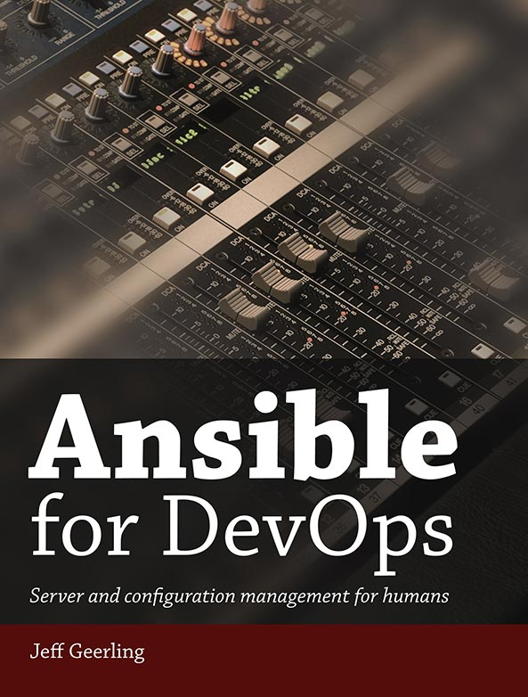

## About Jeff Geerling (geerlingguy)

[Jeff Geerling](https://www.jeffgeerling.com) is an author and software developer from St. Louis, MO. He started using Ansible in 2013 and maintains numerous Ansible works.

## Ansible Books

|  |  |
| :---: | :---: |
| [Ansible for DevOps](https://www.ansiblefordevops.com) | [Ansible for Kubernetes](https://www.ansibleforkubernetes.com) |

## Project Maintenance Status

I maintain over 250 open source projects and two bestselling books, and without some level of automation (and maybe a little sleep from time to time), it would be impossible for me to keep all the projects relevant.

I use a [stale issue bot](https://www.jeffgeerling.com/blog/2020/enabling-stale-issue-bot-on-my-github-repositories) to clean up repository issues and PRs, and I also sometimes informally put a project into 'maintenance only' mode. That is indicated in the listings below using the following conventions:

| Icon | Description |
| ---: | ----------- |
| &#10003; | Actively used and maintained. |
| &#33; | Maintenance and bugfixes only. |
| &#10007; | Not maintained. |

## Table of Contents

  - [Ansible-based Operators](#operators)
  - [Container Images Built with Ansible](#container-images)
  - [Container Images for Ansible Testing](#container-images-testing)
  - [Ansible Collections](#collections)
  - [Ansible Roles](#roles)
  - [Ansible Projects](#projects)
  - [Ansible Videos and Presentations](#presentations)

## Ansible-based Operators

| Name | Test Status | Maintained? | Repository |
| ---- | ----------- | ----------- | ---------- |
| [Drupal Operator](https://github.com/geerlingguy/drupal-operator) |  | &#10003; | [GitHub](https://github.com/geerlingguy/drupal-operator) |
| [MariaDB Operator](https://github.com/geerlingguy/mariadb-operator) |  | &#10003; | [GitHub](https://github.com/geerlingguy/mariadb-operator) |
| [Mcrouter Operator](https://github.com/geerlingguy/mcrouter-operator) |  | &#33; | [GitHub](https://github.com/geerlingguy/mcrouter-operator) |
| [Ansible Tower/AWX Operator](https://github.com/geerlingguy/tower-operator) |  | &#10007; | [GitHub](https://github.com/geerlingguy/tower-operator) |

<a href="#">Back to Top</a>

## Container Images Built with Ansible

| Name | Test Status | Maintained? | Repository |
| ---- | ----------- | ----------- | ---------- |
| [geerlingguy/drupal](https://hub.docker.com/r/geerlingguy/drupal/) |  | &#10003; | [GitHub](https://github.com/geerlingguy/drupal-container) |
| [geerlingguy/fathom](https://hub.docker.com/r/geerlingguy/fathom/) |  | &#10003; | [GitHub](https://github.com/geerlingguy/fathom-container) |
| [geerlingguy/php-apache](https://hub.docker.com/r/geerlingguy/php-apache/) |  | &#10003; | [GitHub](https://github.com/geerlingguy/php-apache-container) |
| [geerlingguy/solr](https://hub.docker.com/r/geerlingguy/solr/) |  | &#10003; | [GitHub](https://github.com/geerlingguy/solr-container) |

<a href="#">Back to Top</a>

## Container Images for Ansible Testing

| Name | Test Status | Maintained? | Repository |
| ---- | ----------- | ----------- | ---------- |
| [geerlingguy/docker-ubuntu2004-ansible](https://hub.docker.com/r/geerlingguy/docker-ubuntu2004-ansible/) |  | &#10003; | [GitHub](https://github.com/geerlingguy/docker-ubuntu2004-ansible) |
| [geerlingguy/docker-ubuntu1804-ansible](https://hub.docker.com/r/geerlingguy/docker-ubuntu1804-ansible/) |  | &#10003; | [GitHub](https://github.com/geerlingguy/docker-ubuntu1804-ansible) |
| [geerlingguy/docker-ubuntu1604-ansible](https://hub.docker.com/r/geerlingguy/docker-ubuntu1604-ansible/) |  | &#10003; | [GitHub](https://github.com/geerlingguy/docker-ubuntu1604-ansible) |
| [geerlingguy/docker-ubuntu1404-ansible](https://hub.docker.com/r/geerlingguy/docker-ubuntu1404-ansible/) |  | &#10007; | [GitHub](https://github.com/geerlingguy/docker-ubuntu1404-ansible) |
| [geerlingguy/docker-ubuntu1204-ansible](https://hub.docker.com/r/geerlingguy/docker-ubuntu1204-ansible/) |  | &#10007; | [GitHub](https://github.com/geerlingguy/docker-ubuntu1204-ansible) |
| [geerlingguy/docker-centos8-ansible](https://hub.docker.com/r/geerlingguy/docker-centos8-ansible/) |  | &#10003; | [GitHub](https://github.com/geerlingguy/docker-centos8-ansible) |
| [geerlingguy/docker-centos7-ansible](https://hub.docker.com/r/geerlingguy/docker-centos7-ansible/) |  | &#10003; | [GitHub](https://github.com/geerlingguy/docker-centos7-ansible) |
| [geerlingguy/docker-centos6-ansible](https://hub.docker.com/r/geerlingguy/docker-centos6-ansible/) |  | &#10003; | [GitHub](https://github.com/geerlingguy/docker-centos6-ansible) |
| [geerlingguy/docker-debian10-ansible](https://hub.docker.com/r/geerlingguy/docker-debian10-ansible/) |  | &#10003; | [GitHub](https://github.com/geerlingguy/docker-debian10-ansible) |
| [geerlingguy/docker-debian9-ansible](https://hub.docker.com/r/geerlingguy/docker-debian9-ansible/) |  | &#10003; | [GitHub](https://github.com/geerlingguy/docker-debian9-ansible) |
| [geerlingguy/docker-debian8-ansible](https://hub.docker.com/r/geerlingguy/docker-debian8-ansible/) |  | &#10007; | [GitHub](https://github.com/geerlingguy/docker-debian8-ansible) |
| [geerlingguy/docker-ubi8-ansible](https://hub.docker.com/r/geerlingguy/docker-ubi8-ansible/) |  | &#10003; | [GitHub](https://github.com/geerlingguy/docker-ubi8-ansible) |
| [geerlingguy/docker-amazonlinux2-ansible](https://hub.docker.com/r/geerlingguy/docker-amazonlinux2-ansible/) |  | &#10003; | [GitHub](https://github.com/geerlingguy/docker-amazonlinux2-ansible) |
| [geerlingguy/docker-fedora32-ansible](https://hub.docker.com/r/geerlingguy/docker-fedora32-ansible/) |  | &#10003; | [GitHub](https://github.com/geerlingguy/docker-fedora32-ansible) |
| [geerlingguy/docker-fedora31-ansible](https://hub.docker.com/r/geerlingguy/docker-fedora31-ansible/) |  | &#10003; | [GitHub](https://github.com/geerlingguy/docker-fedora31-ansible) |
| [geerlingguy/docker-fedora30-ansible](https://hub.docker.com/r/geerlingguy/docker-fedora30-ansible/) |  | &#10003; | [GitHub](https://github.com/geerlingguy/docker-fedora30-ansible) |
| [geerlingguy/docker-fedora29-ansible](https://hub.docker.com/r/geerlingguy/docker-fedora29-ansible/) |  | &#10007; | [GitHub](https://github.com/geerlingguy/docker-fedora29-ansible) |
| [geerlingguy/docker-fedora27-ansible](https://hub.docker.com/r/geerlingguy/docker-fedora27-ansible/) |  | &#10007; | [GitHub](https://github.com/geerlingguy/docker-fedora27-ansible) |
| [geerlingguy/docker-fedora24-ansible](https://hub.docker.com/r/geerlingguy/docker-fedora24-ansible/) |  | &#10007; | [GitHub](https://github.com/geerlingguy/docker-fedora24-ansible) |

See also: [Testing your roles with Molecule](https://www.jeffgeerling.com/blog/2018/testing-your-ansible-roles-molecule)

<a href="#">Back to Top</a>

## Ansible Collections

| Name | Test Status | Maintained? | Repository |
| ---- | ----------- | ----------- | ---------- |
| [geerlingguy.k8s](https://galaxy.ansible.com/geerlingguy/k8s) |  | &#10003; | [GitHub](https://github.com/geerlingguy/ansible-collection-k8s) |
| [geerlingguy.php_roles](https://galaxy.ansible.com/geerlingguy/php_roles) |  | &#10003; | [GitHub](https://github.com/geerlingguy/ansible-collection-php_roles) |

<a href="#">Back to Top</a>

## Ansible Roles

| Name | Test Status | Maintained? | Repository |
| ---- | ----------- | ----------- | ---------- |
| [geerlingguy.adminer](https://galaxy.ansible.com/geerlingguy/adminer) |  | &#10003; | [GitHub](https://github.com/geerlingguy/ansible-role-adminer) |
| [geerlingguy.ansible](https://galaxy.ansible.com/geerlingguy/ansible) |  | &#10003; | [GitHub](https://github.com/geerlingguy/ansible-role-ansible) |
| [geerlingguy.apache](https://galaxy.ansible.com/geerlingguy/apache) |  | &#10003; | [GitHub](https://github.com/geerlingguy/ansible-role-apache) |
| [geerlingguy.apache-php-fpm](https://galaxy.ansible.com/geerlingguy/apache-php-fpm) |  | &#10003; | [GitHub](https://github.com/geerlingguy/ansible-role-apache-php-fpm) |
| [geerlingguy.aws-inspector](https://galaxy.ansible.com/geerlingguy/aws-inspector) |  | &#33; | [GitHub](https://github.com/geerlingguy/ansible-role-aws-inspector) |
| [geerlingguy.awx](https://galaxy.ansible.com/geerlingguy/awx) |  | &#33; | [GitHub](https://github.com/geerlingguy/ansible-role-awx) |
| [geerlingguy.backup](https://galaxy.ansible.com/geerlingguy/backup) |  | &#10003; | [GitHub](https://github.com/geerlingguy/ansible-role-backup) |
| [geerlingguy.bad_judgement](https://galaxy.ansible.com/geerlingguy/bad_judgement) |  | &#33; | [GitHub](https://github.com/geerlingguy/ansible-role-bad_judgement) |
| [geerlingguy.blackfire](https://galaxy.ansible.com/geerlingguy/blackfire) |  | &#10003; | [GitHub](https://github.com/geerlingguy/ansible-role-blackfire) |
| [geerlingguy.certbot](https://galaxy.ansible.com/geerlingguy/certbot) |  | &#10003; | [GitHub](https://github.com/geerlingguy/ansible-role-certbot) |
| [geerlingguy.clamav](https://galaxy.ansible.com/geerlingguy/clamav) |  | &#10003; | [GitHub](https://github.com/geerlingguy/ansible-role-clamav) |
| [geerlingguy.collectd-signalfx](https://galaxy.ansible.com/geerlingguy/collectd-signalfx) |  | &#33; | [GitHub](https://github.com/geerlingguy/ansible-role-collectd-signalfx) |
| [geerlingguy.composer](https://galaxy.ansible.com/geerlingguy/composer) |  | &#10003; | [GitHub](https://github.com/geerlingguy/ansible-role-composer) |
| [geerlingguy.daemonize](https://galaxy.ansible.com/geerlingguy/daemonize) |  | &#10003; | [GitHub](https://github.com/geerlingguy/ansible-role-daemonize) |
| [geerlingguy.docker](https://galaxy.ansible.com/geerlingguy/docker) |  | &#10003; | [GitHub](https://github.com/geerlingguy/ansible-role-docker) |
| [geerlingguy.docker_arm](https://galaxy.ansible.com/geerlingguy/docker_arm) |  | &#10003; | [GitHub](https://github.com/geerlingguy/ansible-role-docker_arm) |
| [geerlingguy.dotfiles](https://galaxy.ansible.com/geerlingguy/dotfiles) |  | &#10003; | [GitHub](https://github.com/geerlingguy/ansible-role-dotfiles) |
| [geerlingguy.drupal](https://galaxy.ansible.com/geerlingguy/drupal) |  | &#10003; | [GitHub](https://github.com/geerlingguy/ansible-role-drupal) |
| [geerlingguy.drupal-console](https://galaxy.ansible.com/geerlingguy/drupal-console) |  | &#33; | [GitHub](https://github.com/geerlingguy/ansible-role-drupal-console) |
| [geerlingguy.drush](https://galaxy.ansible.com/geerlingguy/drush) |  | &#10003; | [GitHub](https://github.com/geerlingguy/ansible-role-drush) |
| [geerlingguy.ecr_container_build](https://galaxy.ansible.com/geerlingguy/ecr_container_build) |  | &#33; | [GitHub](https://github.com/geerlingguy/ansible-role-ecr_container_build) |
| [geerlingguy.elasticsearch](https://galaxy.ansible.com/geerlingguy/elasticsearch) |  | &#10003; | [GitHub](https://github.com/geerlingguy/ansible-role-elasticsearch) |
| [geerlingguy.elasticsearch-curator](https://galaxy.ansible.com/geerlingguy/elasticsearch-curator) |  | &#10003; | [GitHub](https://github.com/geerlingguy/ansible-role-elasticsearch-curator) |
| [geerlingguy.exim](https://galaxy.ansible.com/geerlingguy/exim) |  | &#10003; | [GitHub](https://github.com/geerlingguy/ansible-role-exim) |
| [geerlingguy.fathom](https://galaxy.ansible.com/geerlingguy/fathom) |  | &#10003; | [GitHub](https://github.com/geerlingguy/ansible-role-fathom) |
| [geerlingguy.filebeat](https://galaxy.ansible.com/geerlingguy/filebeat) |  | &#10003; | [GitHub](https://github.com/geerlingguy/ansible-role-filebeat) |
| [geerlingguy.firewall](https://galaxy.ansible.com/geerlingguy/firewall) |  | &#10003; | [GitHub](https://github.com/geerlingguy/ansible-role-firewall) |
| [geerlingguy.fluentd](https://galaxy.ansible.com/geerlingguy/fluentd) |  | &#10003; | [GitHub](https://github.com/geerlingguy/ansible-role-fluentd) |
| [geerlingguy.git](https://galaxy.ansible.com/geerlingguy/git) |  | &#10003; | [GitHub](https://github.com/geerlingguy/ansible-role-git) |
| [geerlingguy.github-users](https://galaxy.ansible.com/geerlingguy/github-users) |  | &#10003; | [GitHub](https://github.com/geerlingguy/ansible-role-github-users) |
| [geerlingguy.gitlab](https://galaxy.ansible.com/geerlingguy/gitlab) |  | &#10003; | [GitHub](https://github.com/geerlingguy/ansible-role-gitlab) |
| [geerlingguy.glusterfs](https://galaxy.ansible.com/geerlingguy/glusterfs) |  | &#33; | [GitHub](https://github.com/geerlingguy/ansible-role-glusterfs) |
| [geerlingguy.gogs](https://galaxy.ansible.com/geerlingguy/gogs) |  | &#33; | [GitHub](https://github.com/geerlingguy/ansible-role-gogs) |
| [geerlingguy.haproxy](https://galaxy.ansible.com/geerlingguy/haproxy) |  | &#10003; | [GitHub](https://github.com/geerlingguy/ansible-role-haproxy) |
| [geerlingguy.hdparm](https://galaxy.ansible.com/geerlingguy/hdparm) |  | &#33; | [GitHub](https://github.com/geerlingguy/ansible-role-hdparm) |
| [geerlingguy.helm](https://galaxy.ansible.com/geerlingguy/helm) |  | &#33; | [GitHub](https://github.com/geerlingguy/ansible-role-helm) |
| [geerlingguy.homebrew](https://galaxy.ansible.com/geerlingguy/homebrew) |  | &#10003; | [GitHub](https://github.com/geerlingguy/ansible-role-homebrew) |
| [geerlingguy.htpasswd](https://galaxy.ansible.com/geerlingguy/htpasswd) |  | &#10003; | [GitHub](https://github.com/geerlingguy/ansible-role-htpasswd) |
| [geerlingguy.java](https://galaxy.ansible.com/geerlingguy/java) |  | &#10003; | [GitHub](https://github.com/geerlingguy/ansible-role-java) |
| [geerlingguy.jenkins](https://galaxy.ansible.com/geerlingguy/jenkins) |  | &#10003; | [GitHub](https://github.com/geerlingguy/ansible-role-jenkins) |
| [geerlingguy.k8s_manifests](https://galaxy.ansible.com/geerlingguy/k8s_manifests) |  | &#10003; | [GitHub](https://github.com/geerlingguy/ansible-role-k8s_manifests) |
| [geerlingguy.kibana](https://galaxy.ansible.com/geerlingguy/kibana) |  | &#10003; | [GitHub](https://github.com/geerlingguy/ansible-role-kibana) |
| [geerlingguy.kubernetes](https://galaxy.ansible.com/geerlingguy/kubernetes) |  | &#10003; | [GitHub](https://github.com/geerlingguy/ansible-role-kubernetes) |
| [geerlingguy.logstash](https://galaxy.ansible.com/geerlingguy/logstash) |  | &#10003; | [GitHub](https://github.com/geerlingguy/ansible-role-logstash) |
| [geerlingguy.logstash-forwarder](https://galaxy.ansible.com/geerlingguy/logstash-forwarder) |  | &#10003; | [GitHub](https://github.com/geerlingguy/ansible-role-logstash-forwarder) |
| [geerlingguy.mailhog](https://galaxy.ansible.com/geerlingguy/mailhog) |  | &#10003; | [GitHub](https://github.com/geerlingguy/ansible-role-mailhog) |
| [geerlingguy.mas](https://galaxy.ansible.com/geerlingguy/mas) |  | &#10003; | [GitHub](https://github.com/geerlingguy/ansible-role-mas) |
| [geerlingguy.memcached](https://galaxy.ansible.com/geerlingguy/memcached) |  | &#10003; | [GitHub](https://github.com/geerlingguy/ansible-role-memcached) |
| [geerlingguy.munin](https://galaxy.ansible.com/geerlingguy/munin) |  | &#10003; | [GitHub](https://github.com/geerlingguy/ansible-role-munin) |
| [geerlingguy.munin-node](https://galaxy.ansible.com/geerlingguy/munin-node) |  | &#10003; | [GitHub](https://github.com/geerlingguy/ansible-role-munin-node) |
| [geerlingguy.mysql](https://galaxy.ansible.com/geerlingguy/mysql) |  | &#10003; | [GitHub](https://github.com/geerlingguy/ansible-role-mysql) |
| [geerlingguy.nfs](https://galaxy.ansible.com/geerlingguy/nfs) |  | &#10003; | [GitHub](https://github.com/geerlingguy/ansible-role-nfs) |
| [geerlingguy.nginx](https://galaxy.ansible.com/geerlingguy/nginx) |  | &#10003; | [GitHub](https://github.com/geerlingguy/ansible-role-nginx) |
| [geerlingguy.nodejs](https://galaxy.ansible.com/geerlingguy/nodejs) |  | &#10003; | [GitHub](https://github.com/geerlingguy/ansible-role-nodejs) |
| [geerlingguy.ntp](https://galaxy.ansible.com/geerlingguy/ntp) |  | &#10003; | [GitHub](https://github.com/geerlingguy/ansible-role-ntp) |
| [geerlingguy.packer](https://galaxy.ansible.com/geerlingguy/packer) |  | &#10003; | [GitHub](https://github.com/geerlingguy/ansible-role-packer) |
| [geerlingguy.packer-debian](https://galaxy.ansible.com/geerlingguy/packer-debian) |  | &#10003; | [GitHub](https://github.com/geerlingguy/ansible-role-packer-debian) |
| [geerlingguy.packer_rhel](https://galaxy.ansible.com/geerlingguy/packer_rhel) |  | &#10003; | [GitHub](https://github.com/geerlingguy/ansible-role-packer_rhel) |
| [geerlingguy.passenger](https://galaxy.ansible.com/geerlingguy/passenger) |  | &#33; | [GitHub](https://github.com/geerlingguy/ansible-role-passenger) |
| [geerlingguy.phergie](https://galaxy.ansible.com/geerlingguy/phergie) |  | &#10007; | [GitHub](https://github.com/geerlingguy/ansible-role-phergie) |
| [geerlingguy.php](https://galaxy.ansible.com/geerlingguy/php) |  | &#10003; | [GitHub](https://github.com/geerlingguy/ansible-role-php) |
| [geerlingguy.php-memcached](https://galaxy.ansible.com/geerlingguy/php-memcached) |  | &#10003; | [GitHub](https://github.com/geerlingguy/ansible-role-php-memcached) |
| [geerlingguy.phpmyadmin](https://galaxy.ansible.com/geerlingguy/phpmyadmin) |  | &#33; | [GitHub](https://github.com/geerlingguy/ansible-role-phpmyadmin) |
| [geerlingguy.php-mysql](https://galaxy.ansible.com/geerlingguy/php-mysql) |  | &#10003; | [GitHub](https://github.com/geerlingguy/ansible-role-php-mysql) |
| [geerlingguy.php-pear](https://galaxy.ansible.com/geerlingguy/php-pear) |  | &#33; | [GitHub](https://github.com/geerlingguy/ansible-role-php-pear) |
| [geerlingguy.php-pecl](https://galaxy.ansible.com/geerlingguy/php-pecl) |  | &#10003; | [GitHub](https://github.com/geerlingguy/ansible-role-php-pecl) |
| [geerlingguy.php-pgsql](https://galaxy.ansible.com/geerlingguy/php-pgsql) |  | &#10003; | [GitHub](https://github.com/geerlingguy/ansible-role-php-pgsql) |
| [geerlingguy.php-redis](https://galaxy.ansible.com/geerlingguy/php-redis) |  | &#10003; | [GitHub](https://github.com/geerlingguy/ansible-role-php-redis) |
| [geerlingguy.php-tideways](https://galaxy.ansible.com/geerlingguy/php-tideways) |  | &#10003; | [GitHub](https://github.com/geerlingguy/ansible-role-php-tideways) |
| [geerlingguy.php-versions](https://galaxy.ansible.com/geerlingguy/php-versions) |  | &#10003; | [GitHub](https://github.com/geerlingguy/ansible-role-php-versions) |
| [geerlingguy.php-xdebug](https://galaxy.ansible.com/geerlingguy/php-xdebug) |  | &#10003; | [GitHub](https://github.com/geerlingguy/ansible-role-php-xdebug) |
| [geerlingguy.php-xhprof](https://galaxy.ansible.com/geerlingguy/php-xhprof) |  | &#10003; | [GitHub](https://github.com/geerlingguy/ansible-role-php-xhprof) |
| [geerlingguy.pimpmylog](https://galaxy.ansible.com/geerlingguy/pimpmylog) |  | &#33; | [GitHub](https://github.com/geerlingguy/ansible-role-pimpmylog) |
| [geerlingguy.pip](https://galaxy.ansible.com/geerlingguy/pip) |  | &#10003; | [GitHub](https://github.com/geerlingguy/ansible-role-pip) |
| [geerlingguy.postfix](https://galaxy.ansible.com/geerlingguy/postfix) |  | &#10003; | [GitHub](https://github.com/geerlingguy/ansible-role-postfix) |
| [geerlingguy.postgresql](https://galaxy.ansible.com/geerlingguy/postgresql) |  | &#10003; | [GitHub](https://github.com/geerlingguy/ansible-role-postgresql) |
| [geerlingguy.puppet](https://galaxy.ansible.com/geerlingguy/puppet) |  | &#33; | [GitHub](https://github.com/geerlingguy/ansible-role-puppet) |
| [geerlingguy.rabbitmq](https://galaxy.ansible.com/geerlingguy/rabbitmq) |  | &#10003; | [GitHub](https://github.com/geerlingguy/ansible-role-rabbitmq) |
| [geerlingguy.raspberry-pi](https://galaxy.ansible.com/geerlingguy/raspberry-pi) |  | &#10003; | [GitHub](https://github.com/geerlingguy/ansible-role-raspberry-pi) |
| [geerlingguy.redis](https://galaxy.ansible.com/geerlingguy/redis) |  | &#10003; | [GitHub](https://github.com/geerlingguy/ansible-role-redis) |
| [geerlingguy.repo-dotdeb](https://galaxy.ansible.com/geerlingguy/repo-dotdeb) |  | &#33; | [GitHub](https://github.com/geerlingguy/ansible-role-repo-dotdeb) |
| [geerlingguy.repo-epel](https://galaxy.ansible.com/geerlingguy/repo-epel) |  | &#10003; | [GitHub](https://github.com/geerlingguy/ansible-role-repo-epel) |
| [geerlingguy.repo-puias](https://galaxy.ansible.com/geerlingguy/repo-puias) |  | &#33; | [GitHub](https://github.com/geerlingguy/ansible-role-repo-puias) |
| [geerlingguy.repo-remi](https://galaxy.ansible.com/geerlingguy/repo-remi) |  | &#10003; | [GitHub](https://github.com/geerlingguy/ansible-role-repo-remi) |
| [geerlingguy.ruby](https://galaxy.ansible.com/geerlingguy/ruby) |  | &#10003; | [GitHub](https://github.com/geerlingguy/ansible-role-ruby) |
| [geerlingguy.samba](https://galaxy.ansible.com/geerlingguy/samba) |  | &#10003; | [GitHub](https://github.com/geerlingguy/ansible-role-samba) |
| [geerlingguy.security](https://galaxy.ansible.com/geerlingguy/security) |  | &#10003; | [GitHub](https://github.com/geerlingguy/ansible-role-security) |
| [geerlingguy.solr](https://galaxy.ansible.com/geerlingguy/solr) |  | &#10003; | [GitHub](https://github.com/geerlingguy/ansible-role-solr) |
| [geerlingguy.sonar](https://galaxy.ansible.com/geerlingguy/sonar) |  | &#10007; | [GitHub](https://github.com/geerlingguy/ansible-role-sonar) |
| [geerlingguy.sonar-runner](https://galaxy.ansible.com/geerlingguy/sonar-runner) |  | &#10007; | [GitHub](https://github.com/geerlingguy/ansible-role-sonar-runner) |
| [geerlingguy.ssh-chroot-jail](https://galaxy.ansible.com/geerlingguy/ssh-chroot-jail) |  | &#10003; | [GitHub](https://github.com/geerlingguy/ansible-role-ssh-chroot-jail) |
| [geerlingguy.supervisor](https://galaxy.ansible.com/geerlingguy/supervisor) |  | &#10003; | [GitHub](https://github.com/geerlingguy/ansible-role-supervisor) |
| [geerlingguy.svn](https://galaxy.ansible.com/geerlingguy/svn) |  | &#33; | [GitHub](https://github.com/geerlingguy/ansible-role-svn) |
| [geerlingguy.svn2git](https://galaxy.ansible.com/geerlingguy/svn2git) |  | &#33; | [GitHub](https://github.com/geerlingguy/ansible-role-svn2git) |
| [geerlingguy.swap](https://galaxy.ansible.com/geerlingguy/swap) |  | &#10003; | [GitHub](https://github.com/geerlingguy/ansible-role-swap) |
| [geerlingguy.tomcat6](https://galaxy.ansible.com/geerlingguy/tomcat6) |  | &#10007; | [GitHub](https://github.com/geerlingguy/ansible-role-tomcat6) |
| [geerlingguy.varnish](https://galaxy.ansible.com/geerlingguy/varnish) |  | &#10003; | [GitHub](https://github.com/geerlingguy/ansible-role-varnish) |

<a href="#">Back to Top</a>

## Ansible Projects

| Name and Link | Test Status | Maintained? |
| ------------- | ----------- | ----------- |
| [Ansible Requirements Updater](https://github.com/geerlingguy/ansible-requirements-updater) | N/A | &#10003; |
| [Mac Development Playbook](https://github.com/geerlingguy/mac-dev-playbook) |  | &#10003; |
| [Packer Boxes](https://github.com/geerlingguy/packer-boxes) |  | &#10003; |
| [Drupal VM](https://www.drupalvm.com) |  | &#10003; |
| [Raspberry Pi Dramble](https://www.pidramble.com) |  | &#10003; |
| [Drupal Pi](https://github.com/geerlingguy/drupal-pi) |  | &#10003; |
| [Turing Pi Cluster](https://github.com/geerlingguy/turing-pi-cluster) |  | &#33; |
| [Ansible Vagrant Examples](https://github.com/geerlingguy/ansible-vagrant-examples) | N/A | &#33; |

Also see [all my blog posts about Ansible](https://www.jeffgeerling.com/category/ansible) and [all my YouTube videos about Ansible](https://www.youtube.com/playlist?list=PL2_OBreMn7FplshFCWYlaN2uS8et9RjNG).

<a href="#">Back to Top</a>

## Ansible Videos and Presentations

| Place and Date | Title |
| -------------- | ----- |
| Meetup January 14, 2014 | [Local Dev on Virtual Machines - Vagrant, VirtualBox and Ansible](https://www.jeffgeerling.com/blog/virtualbox-vagrant-and-ansible-local-development) |
| DrupalCon Austin June 5, 2014 | [DevOps for Humans: Ansible for Drupal Deployment Victory!](https://www.jeffgeerling.com/blog/devops-humans-ansible-presentation-drupalcon)
| YouTube March 8, 2015 | [Ansible serial/forks demo on a Cluster of Raspberry Pis](https://www.youtube.com/watch?v=rRJQiHydVG4) |
| MidCamp 2015 March 21, 2015 | [Ansible + Drupal: A Fortuitous DevOps Match](https://www.jeffgeerling.com/blog/midcamp-2015-ansible-drupal-8-presentation) |
| YouTube July 14, 2015 | [Ansible 101 on a Cluster of Raspberry Pi 2s](https://www.youtube.com/watch?v=ZNB1at8mJWY) |
| YouTube July 27, 2015 | [Nginx Load Balancer Visualization on a Cluster of Raspberry Pis](https://www.youtube.com/watch?v=7Tf2f5gdO4I) |
| php[tek] 2016 May 25, 2016 | [Highly Available Drupal on a Raspberry Pi Cluster](https://www.jeffgeerling.com/blog/2016/highly-available-drupal-on-raspberry-pi-cluster-phptek-2016-session) |
| AnsibleFest SF 2016 July 28, 2016 | [Ansible Roles for Fun and Profit!](https://www.ansible.com/ansible-roles-by-acquia) |
| MidCamp 2018 March 10, 2018 | [Jenkins or: How I learned to stop worrying and love automation](https://www.midcamp.org/2018/topic-proposal/jenkins-or-how-i-learned-stop-worrying-and-love-automation) |
| AnsibleFest Austin 2018 August 21, 2018 | [Make your Ansible playbooks flexible, maintainable, and scalable](https://www.youtube.com/watch?v=kNDL13MJG6Y) |
| AnsibleFest Atlanta 2019 September 25, 2019 | [There's a Role for that! How to evaluate community roles for your playbook](https://www.jeffgeerling.com/blog/2019/how-evaluate-community-ansible-roles-your-playbooks) |
| DrupalCon Seattle 2019 November 26, 2019 | [Everything I know about Kubernetes I learned from a cluster of Raspberry Pis](https://www.jeffgeerling.com/blog/2019/everything-i-know-about-kubernetes-i-learned-cluster-raspberry-pis) |
| YouTube April 2020 | [Ansible 101 streaming series](https://www.jeffgeerling.com/blog/2020/ansible-101-jeff-geerling-youtube-streaming-series) |

<a href="#">Back to Top</a>

## Inspiration

This site was inspired by [Robert de Bock's similar Ansible roles site](https://robertdebock.nl).
